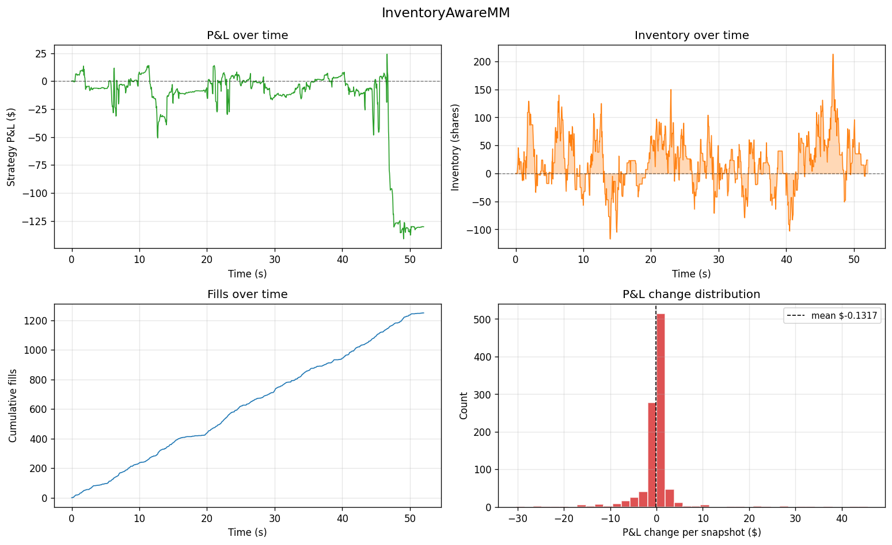

# Limit Order Book Simulator

A Python implementation of a price-time priority matching engine, a Poisson-driven order flow simulator, and three market-making strategies (including Avellaneda-Stoikov). Includes a regime-aware backtesting framework and an interactive Streamlit dashboard for exploring how strategies behave across market conditions.

**[→ Try the live interactive demo](https://lob-simulator-vrodawg.streamlit.app/)**



## What's in the repo

The project is built bottom-up from the data structures real exchanges use to the strategies that trade on top of them.

- A price-time priority **matching engine** with proper FIFO queues at each price level. Uses `OrderedDict` for O(1) append, peek, pop-front, and cancel-by-id, which mirrors the intrusive doubly-linked list + hashmap design used in production HFT systems.

- A **Poisson-arrival order flow simulator** with new limit orders, market orders, and cancellations. Tunable rates can produce balanced or trending market regimes. Strategy orders are protected from random cancellations.

- A **strategy framework** with position tracking, mark-to-market P&L, and lifecycle hooks. Auto-detects fills against the strategy's own order IDs.

- Three market-making strategies of increasing sophistication:
  - `FixedSpreadMarketMaker` — naive baseline, fixed offset from mid
  - `InventoryAwareMarketMaker` — skews quotes by inventory to flatten directional exposure
  - `AvellanedaStoikovMarketMaker` — the 2008 academic optimal model with analytically derived skew and half-spread

- **Standard quant performance metrics**: Sharpe ratio, max drawdown, inventory variance, fill rate, realized spread, and adverse selection at configurable horizons.

- **Six-panel and four-panel dashboard plots** for both market-state and strategy-state visualization.

- **134 tests** covering everything from order validation to multi-strategy integration backtests.

## Headline result: strategy ranking flips across regimes

| Strategy | Final P&L (Balanced) | Final P&L (Bearish) | Max abs inventory (Bearish) |
|---|---:|---:|---:|
| FixedSpread | **+$321.54** | −$136.75 | **12,904** |
| InventoryAware | −$130.25 | **+$464.50** | 278 |
| AvellanedaStoikov | −$439.23 | −$379.38 | 90 |

In a balanced (mean-reverting) market, FixedSpread wins on raw P&L because it captures spread efficiently and isn't paying for risk insurance it doesn't need. In a bearish (trending) market, the same strategy accumulates 12,904 shares of toxic long inventory and gets run over. The inventory-aware variant kept its exposure under 300 shares in both regimes and was the most robust performer.

Reproduce with:

```bash
python examples/regime_comparison.py
```

## Quick start

Requires Python 3.10+.

```bash
git clone https://github.com/VroDawg/limit-order-book-simulator.git
cd limit-order-book-simulator
python -m venv venv
venv\Scripts\activate          # Windows
# source venv/bin/activate     # macOS / Linux
pip install -e ".[dev,ui]"
```

### Run the demos

```bash
# 3-way strategy comparison (balanced regime)
python examples/backtest_demo.py

# regime comparison (3 strategies × 2 regimes)
python examples/regime_comparison.py

# interactive Streamlit app (locally)
streamlit run streamlit_app.py
```

### Run the tests

```bash
pytest -v
```

## Architecture

​```
lob/
|--- order.py              # Order dataclass, Side / OrderType / OrderStatus enums
|--- price_level.py        # FIFO queue at a single price (O(1) for all operations)
|--- order_book.py         # Two-sided sorted book with O(1) cancel-by-id index
|--- matching_engine.py    # Price-time priority matching, emits Trade events
|--- order_flow.py         # Poisson-driven simulator with cancellations
|--- position.py           # Inventory + cash, MTM P&L
|--- strategy.py           # Strategy base class + 3 concrete market makers
|--- simulation.py         # Wires book + engine + flow + strategy together
|--- metrics.py            # Sharpe, drawdown, adverse selection, etc.
└--- plotting.py           # Matplotlib dashboards
​```

Some specific design choices I made:

- The `OrderBook` is a pure data structure. All matching logic lives in the `MatchingEngine`. This separation makes each piece independently testable and mirrors how real exchange systems are built.

- Strategies are protected from the noise simulator's random cancellations via an `is_protected` callback. This way the strategy is always the only entity managing its own quotes.

- The `Strategy` base class auto-detects fills against its tracked order IDs, so concrete strategies only need to implement `on_step()` for their trading logic.

## Tech stack

Python, NumPy, pandas, sortedcontainers, matplotlib, pytest, Streamlit.